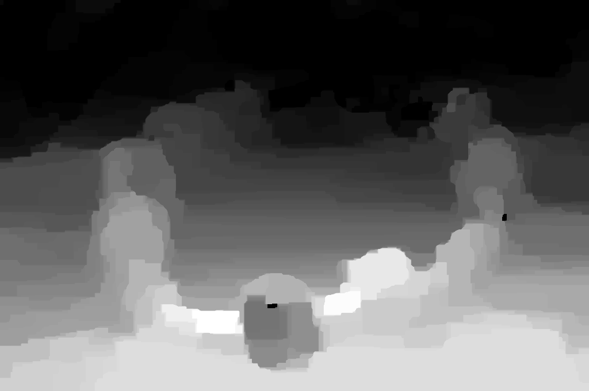

# Depth from Defocus
* Check [the video lectures](https://youtu.be/_PfKnkGAcuc) by [Prof. Nayar](http://www.cs.columbia.edu/~nayar/).

# Setup
* There is no `gco_python` anymore. Just install it with `pip install pygco`.
  * About `pygco`: [Graphcuts for Python: pygco](https://peekaboo-vision.blogspot.com/2012/05/graphcuts-for-python-pygco.html)
* Input image source: [Focus stacking test (06/08/13)](http://imajeenyus.com/computer/20130806_focus_stacking/index.shtml).

  

# Results
* The computing time is too long for realtime applications.
  * But the demo here were in realtime: [Depth from Defocus](https://www.cs.columbia.edu/CAVE/projects/depth_defocus/)
* Final result will be saved in `output/graph/`.
  
  
